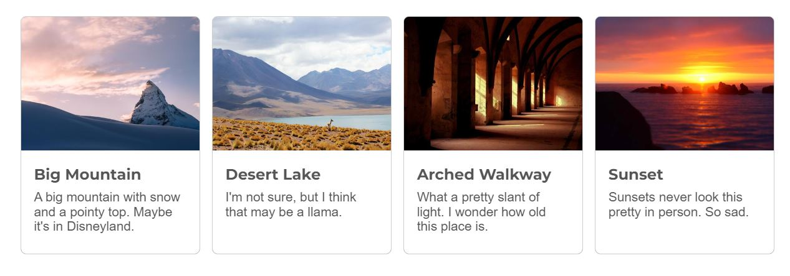

<!-- cSpell:enable  -->

# Overlays and cards

**Objectives**: Add a text overlay to your hero image. Use a dynamic font for the `<h1>` in the overlay. Add four cards to your site. Add a hover effect to your cards.

**Concepts covered**: The position property, text shadows, gradients, CSS filters, the `clamp()` function.

| :warning: This assignment builds on your _CSS fonts and a button_ assignment                                                                                                                                                                                                                                                                                                                                                                               |
| :--------------------------------------------------------------------------------------------------------------------------------------------------------------------------------------------------------------------------------------------------------------------------------------------------------------------------------------------------------------------------------------------------------------------------------------------------------- |
| After cloning this repo and opening it in VSCode, copy the following files and folders from your _CSS fonts and a button_ assignment into this repo.<br><br><ul><li>📄 index.html</li><li>📄 favicon.ico</li><li>📁styles</li><li>📁images</li><li>📁about</li><li>📁contact</li></ul><br>**Make sure that you don't copy any other folders or files, including the `test` folder, the hidden `.git` and `.github` folders, and the `package.json` files** |

## Hero overlay

Add a `<p>` as a subtitle to your site. Wrap your `<picture>`, `<h1>` and subtitle in a `<section>` with class `.hero`. Overlay your `<h1>` text and subtitle on top of your hero image using the `position` property. Use either a semi-transparent `background-color`, with or without a gradient or a `filter` to de-emphasize the image, and add a subtle text-shadow to your `<h1>` (and possibly your subtitle) to make it stand out. Don't set the font-size of `<h1>` yet. In the next section, you'll add dynamic font sizing to your `<h1>`.


Requirements for this section:

- A `<section>` with class `.hero` that contains your `<picture>`, `<h1>` and subtitle
- An `<h1>` and `<p>` are overlaid on your hero image using the `position` property – you may group these with a `<div>`. Remember that both `<h1>` and `<p>` have default margins, so you may need to adjust their margins to make the text look right.
- The overlay uses appropriate background colors, gradients, and/or a filter to de-emphasize the image.
- The `<h1>`, and optionally the subtitle, have a subtle text shadow to emphasize them.
- The overlay gradient or filter covers the entire image (no visible gaps)
- The text is positioned – it does not have to be centered. Choose where you would like it to display. Flexbox will simplify positioning text, so don't spend time trying to perfectly position the text. At a minimum, it should at least be offset from the edge of the image.

## Dynamic font size

Use the `clamp()` function to dynamically size your `<h1>` font on your hero image.

| 🎥 Watch [Dynamic font sizing with CSS](https://youtu.be/veQoGy5DsQQ)                                                                                                                                                                                                                                                     |
| :------------------------------------------------------------------------------------------------------------------------------------------------------------------------------------------------------------------------------------------------------------------------------------------------------------------------ |
| This video shows how to use the `clamp()` function to set the font size of your `<h1>` so that it dynamically adjusts its font size so it readable on full screen, but not too big on tablet or mobile. `<br><br>` `<em>In the video I refer to</em>` `vw` `<em>` as "vertical width" but I meant "viewport width".</em>` |

Since you want only the `<h1>` on the hero image to dynamically resize, not the `<h1>` elements on other pages, using the hero class to target it specifically.

```css
.hero h1 {
  font-size: clamp(4rem, 7vw, 7rem);
}
```

_Don't just copy and paste the CSS above, rather figure out the best font sizes for your site._

| 🔥 **Extra, but optional**: Smoother font sizing with _linear interpolation_                                                                                                                                                                                                                                                                                                                                                                                                        |
| :---------------------------------------------------------------------------------------------------------------------------------------------------------------------------------------------------------------------------------------------------------------------------------------------------------------------------------------------------------------------------------------------------------------------------------------------------------------------------------- |
| If you like math and want to have more exact control over your font size using linear interpolation, read CSS Trick's [Linearly Scale font-size with CSS clamp() Based on the Viewport](https://css-tricks.com/linearly-scale-font-size-with-css-clamp-based-on-the-viewport/). The article contains a tool to build the `clamp()` statement for you. Here's a [direct link to the tool](https://codesandbox.io/s/clamp-linear-intepolation-based-on-viewport-width-builder-xgkft). |

`clamp()` is not limited to fonts. You can use it to limit the maximum and minimum size on other elements as well. To learn more, read MDN's page on [clamp()](https://developer.mozilla.org/en-US/docs/Web/CSS/clamp). The page also compares `clamp()` to other useful functions such as `min()` and `max()`.

## Adding cards

Cards are ubiquitous on the internet. They are images, usually with text, that are used to link to other pages or to provide additional information. They are often used to display a collection of items, such as a list of blog posts or a list of products.

For this assignment, we will create four cards. Since we haven't learned layouts yet, don't worry so much if they don't look good on tablet or mobile. We will learn how to use a flexbox to make them responsive in a future assignment.

Below is a sample of some basic cards:



Before we start, we need to determine the maximum width needed for the images on our cards. If we assume a maximum viewport width of 1920px, then the maximum width of our images is 1920px / 4 = 480px. **Crop all of your images to a width of 480px.**

_We are ignoring extra wide viewports and device pixel ratios for now, which do require higher resolution images._

| ⚠️ Make sure your cards all have the same aspect ratio                                                                                                                                                                                                                                    |
| :---------------------------------------------------------------------------------------------------------------------------------------------------------------------------------------------------------------------------------------------------------------------------------------- |
| To make your life easier, crop all your images so that they have the same width and height. Square images (1:1) are easiest to work with when you make your site responsive, but rectangular images are doable. Save your original (full-size) image files for use in a later assignment. |

Requirements for this section:

- Add a `<section>` with class `.cards` that will contain four cards. The section can be inside or outside `<main>`. _If it is inside main, its width will be limited by the `max-width` of main. If the cards are outside main, add a "gutter" of at least 1rem on the left and right to offset the cards from the edge of the screen_
- Add four cards, each with a unique image and text (text can either be always visible or appear on hover). You are welcome to model your cards after ones you've seen online or after some cards we reviewed in class.
- Card images are 480px wide. They can be any height, but should all be the same height. Make sure to add the `width` and `height` attributes to your `` elements so that the browser can reserve space for the image before it loads.
- Images are responsive, in other words, they resize if the card resizes. This means their CSS width is set to 100%, which will cause them to always fill the width of their container. To override the height set in the `` HTML, set the `height` property to `auto` in your CSS.

  ```css
  img {
    width: 100%;
    height: auto;
    display: block;
  }
  ```

- Each card has its content wrapped in an `<a>` element (which can be empty, meaning, you don't have to add an "href" - if it doesn't have an href, set the cursor to pointer).

Below is an example of markup for your cards. You are welcome to adjust it to suit your design.

```html
<section class="cards">
  `<a class="card">
    ` `
    <p>card text</p>
    `</a
  >

  ...
</section>
```

Since, by default, `<a>` elements are inline elements, you will need to set the `display` property of any `<a>` elements inside the `.cards` class to `inline-block` or `block` to make them behave like block elements. However, if you use a flexbox layout, you won't need to do this. To simplify this assignment, I recommend adding this to your CSS and not worrying about changing the `<a>` display property. We will learn more about how to use flexboxes in a future assignment.

```css
.cards {
  display: flex;
  ...;
}

.card {
  flex: 1 1 0;
  ...;
}
```

If you want spacing between the cards you can add gap:

```css
.card {
  display: flex;
  gap: 1rem;
  ...;
}
```

Adjust the margins, padding, font-size, and other properties to suit your design.

### Card hover effect

Use the `:hover` pseudo-class to add a hover effect to your cards. Use one of the examples from class, or one you like. In the image below, the leftmost card has a box-shadow appear on hover.


Add a transition to smooth the hover. The transition property is added to the element in its un-hovered state. The basic format is

```css
transition: property duration timing-function;
```

To transition the `box-shadow` property over 300 milliseconds, you would use

```css
.card {
  ...
  transition: box-shadow 300ms ease;
```

View the [CodePen of these sample cards](https://codepen.io/lsburton/pen/MWwezZW?editors=1100).

## :rocket: Publish on Github Pages

When your assignment is finished, check that is doesn't have any warnings or errors in VS Code, then sync it to Github and publish it on Github Pages. Remember to paste the Github pages URL in the repo _About_ section.

Make sure to test your website on [validator.nu](https://validator.nu/). If you have any errors, fix them before submitting your URL to Learning Suite.

### :star: Assignment tests

_All but the last three tests are from previous assignments._

General HTML structure

- `<head>` has `<title>`, `<meta>` description and favicon info, loads normalize, fonts, and main styles in proper order
- all HTML files should contain an `<h1>`, and only one `<h1>`
- all index.html files have `<header>` containing a `<nav>` and `<ul>`

Tests for main index.html

- main index.html must contain a `<picture>`, one `<main>`, at least two `<article>`, an `<aside>`, and a `<footer>`
- each `<article>` must contain an `<h2>`, at least one `<p>` and an `<a class="button">`

Image tests

- image paths are all lowercase and contain no spaces
- images must be 1920px wide or less
- relative paths to images used, and images must be in the images directory
- non-SVG and non-`<picture>` images have the `` height and width attributes set to the image's intrinsic dimensions
- `<picture>` element must contain three `<source>` elements with media and srcset attributes
- contact page loads an SVG file with ``

CSS tests

- global box-sizing rule set to border-box and :root contains CSS variables
- font-family, color, and line-height set in body
- remove underlines from `<a>` and add :hover class for all `<a>` that contain href attribute
- CSS contains .button style and .button:hover declarations

:sparkles: **new tests**

- hero section contains an `<h1>` and a `<p>`
- hero `h1` font-size set using `clamp()`
- section with class `.cards` contains four cards, each with class `.card`

| :heavy_check_mark: You will also be graded on the following items from the rubric:                                                                                                                                                                          |
| :---------------------------------------------------------------------------------------------------------------------------------------------------------------------------------------------------------------------------------------------------------- |
| <ul><li>Hero image is de-emphasized with a semi-transparent background, a gradient background, or a filter</li><li>Cards have a hover effect with a transition</li><li>The general appearance of your web page – proper spacing, font size, etc. </li></ul> |

_When you are ready for you assignment to be graded, submit a link to your Github repo on Learning Suite for the **CSS Fonts and a Button** assignment_
